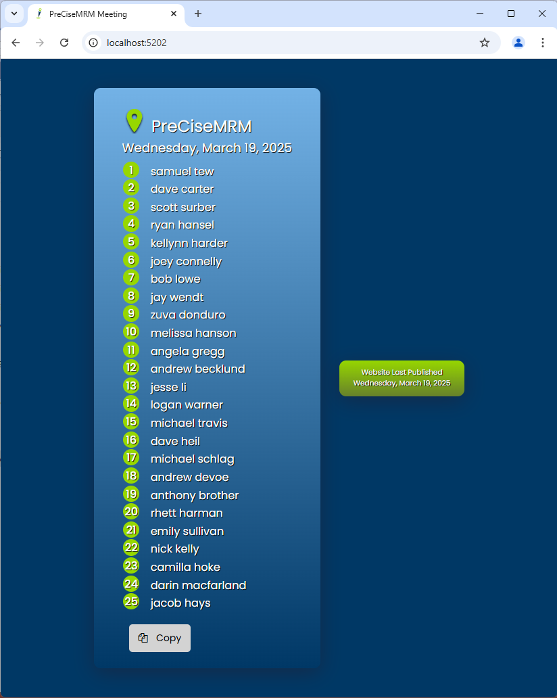

<a name="readme-top"></a>


<!-- PROJECT SHIELDS -->
<p align="center">
  <a href="https://github.com/your-org/your-repo/graphs/contributors">
    
  </a>
  <a href="https://github.com/your-org/your-repo/stargazers">
    
  </a>
  <a href="https://github.com/your-org/your-repo/issues">
    
  </a>
  <a href="https://github.com/your-org/your-repo/blob/main/LICENSE.txt">
    
  </a>
</p>


<!-- PROJECT LOGO -->
<br />
<div align="center">
  <a href="https://github.com/othneildrew/Best-README-Template">
    
  </a>

  <h3 align="center">PreCiseMRM Meeting Web App</h3>

  <p align="center">
    This is the README for this project
    <br />
    <a href="https://github.com/othneildrew/Best-README-Template"><strong>Explore the docs »</strong></a>
    <br />
    <br />
    <a href="https://github.com/othneildrew/Best-README-Template">View Demo</a>
    ·
    <a href="https://github.com/othneildrew/Best-README-Template/issues">Report Bug</a>
    ·
    <a href="https://github.com/othneildrew/Best-README-Template/issues">Request Feature</a>
  </p>
</div>

<!-- TABLE OF CONTENTS -->
<details>
  <summary>Table of Contents</summary>
  <ol>
    <li>
      <a href="#about-the-project">About The Project</a>
      <ul>
        <li><a href="#built-with">Built</a></li>
      </ul>
    </li>
    <li>
      <a href="#getting-started">Getting Started</a>
      <ul>
        <li><a href="#prerequisites">Prerequisites</a></li>
        <li><a href="#installation">Installation</a></li>
      </ul>
    </li>
    <li><a href="#usage">Usage</a></li>
    <li><a href="#license">License</a></li>
    <li><a href="#contact">Contact</a></li>
  </ol>
</details>


<!-- ABOUT THE PROJECT -->
## About The Project

<p align="center">
  <a href="images/web-app.png">
    
  </a>
</p>

Hi, 👋 I'm Joey and welcome to my GitHub repo for my Meeting Web App project 🚀👽😄!

I'm a Software Engineer and once upon a time the small group of people I work with grew in size. 
When it did, we needed a fair way of picking the order in which members spoke during our Scrum meetings. 
A meeting app was created to serve that purpose. 
The application has evolved in many ways, and many times since - this is the most recent version. 

This project is a simple web application that displays a randomized order foreach member on the team. 
It uses the a psuedo-random number generator, seeded w/the current year so that randomized numbers are generated in a repeatable, testable order.
It uses the current DayOfWeek (client-side) to generate a random order, then repeats this process for the total number of DayOfWeek in the current year. 
However, each time it repeats this process it makes sure that no member's full name appears first more than once until all members have been picked first. 
<ul>
  <li><span style="color:teal">example: if today is Wednesday March 19, 2025, it calculates 53 unique Wednesdays in this year</span></li>
  <li><span style="color:teal">if there are 25 members on the team, then 3 is the max number of times any 1 individual can be picked 1st</span></li>
  <li><span style="color:teal">so it generates 3 groups 25 randomized meetings, w/each of the 25 in each group having a unique 1st person</span></li>
</ul>
Once all weekly meetings have been generated it returns the randomized order for the given week based on today's date.

The amount of up-front processing is more involved, but the psuedo-random number generator will always create the same randomized lists, each day throughout the year - only resetting the subsequent year. 
With local testing there doesn't seem to be any appreciable lag when loading the page for the first time, but if I wanted, one fun improvement to fix this heavy up-front lifting would be to:
* after DOM has loaded, but content has yet to be displayed, search for a cached version of each randomized order foreach week of the year cached using Amazon CloudFront CDN
* a Dynamic Content Distribution for an Amazon S3 Bucket can be setup w/public readonly access
* and during each publish the app, w/read-write access, can generate the cached list in a new S3 Bucket
* the existing get randomized list logic can therefore exist client-side only as a fall-back in case it fails to find the cache

I'm going to be hosting this web site on my personal Heroku account (because it's free), but will consider AWS if I can get my company to agree to it 😄
Within Heroku I will also be setting up automatic CI/CD deployments in their cloud platform, triggered everytime I push to master. 

... till next time, see ya 😁!

<p align="right">(<a href="#readme-top">back to top</a>)</p>


### Built With

This section lists the major frameworks/libraries used to bootstrap this project.

* ![.Net] .NET 9 Single App Web Application 
* ![TypeScript] TypeScript 5.8.1 
* ![JavaScript] JavaScript ES2015 
* ![HTML5] Symantic HTML 5 
* ![CSS3] CSS 3 
* ![PowerShell] PowerShell 5.1 
* ![Heroku] Heroku 
* [Heroku .NET Core Buildpack](https://github.com/jincod/dotnetcore-buildpack) 
* Heroku Basic Dyno

<p align="right">(<a href="#readme-top">back to top</a>)</p>


<!-- GETTING STARTED -->
## Getting Started

These are the instructions for setting up this project. 
To get a local copy up and running follow these simple steps. 


### Prerequisites

This is an example of how to list things you need to use the software and how to install them.
* npm
  ```sh
  npm install npm@latest -g
  npm -v
  ```
* typescript
  ```sh
  npm install -g typescript
  tsc -v
  ```
* if "Version 5.8.2" or later does not appear then you have to change your environment variables to ref the new version you just installed.
* i.e. VisualStudio 2022 will use your "Machine" PATH and not your "User" PATH, so make sure you modify the correct path. 
  ```sh
  [Environment]::GetEnvironmentVariable("Path", "Machine")
  ```
* if you'd like a programatic way of adding the path to your newly installed TypeScript, here's a PowerShell script I wrote that you can modify for your local environemnt:
[powershell-script](scripts/dev-path-mover.ps1)


### Installation

1. Clone the repo
   ```sh
   git clone https://github.com/jconnelly-dev/TypeScript-PreCise-Meeting-WebApp.git
   ```
2. Clean solution
   ```sh
   dotnet clean .\PreCiseMeetingWebApp.sln
   ```
3. Rebuild solution
   ```sh
   dotnet build .\PreCiseMeetingWebApp.sln
   ```
4. Run web application
   ```sh
   dotnet run .\PreCiseMeetingWebApp.sln
   ```
5. Open web app
   ```sh
   Start-Process "http://localhost:5202"
   ```
   
* The full build process (w/'tsc --build') is driven by the .csproj file found in the root solution directory of this project. 
* A simple rebuild + run in VisualStudio 2022, or the commands above in a terminal is all you'll need. 

<p align="right">(<a href="#readme-top">back to top</a>)</p>


<!-- USAGE EXAMPLES -->
## Usage

Here is a screenshot demo'ing this project setup and running locally. 
[example-usage](images/example-usage.png)

<p align="right">(<a href="#readme-top">back to top</a>)</p>


<!-- LICENSE -->
## License

Distributed under the Apache License. See `LICENSE.txt` for more information.

<p align="right">(<a href="#readme-top">back to top</a>)</p>


<!-- CONTACT -->
## Contact

**Joseph Connelly** 

You can reach me via:
- [Email](mailto:joseph_a_connelly@yahoo.com)
- [LinkedIn](https://www.linkedin.com/in/joseph-connelly-6775012b5)
- [GitHub](https://github.com/jconnelly-dev)

 
<br />

<p align="right">(<a href="#readme-top">back to top</a>)</p>


<!-- MARKDOWN LINKS & IMAGES -->
[contributors-shield]: https://img.shields.io/github/contributors/othneildrew/Best-README-Template.svg?style=for-the-badge
[contributors-url]: https://github.com/othneildrew/Best-README-Template/graphs/contributors
[stars-shield]: https://img.shields.io/github/stars/othneildrew/Best-README-Template.svg?style=for-the-badge
[stars-url]: https://github.com/othneildrew/Best-README-Template/stargazers
[issues-shield]: https://img.shields.io/github/issues/othneildrew/Best-README-Template.svg?style=for-the-badge
[issues-url]: https://github.com/othneildrew/Best-README-Template/issues
[license-shield]: https://img.shields.io/github/license/othneildrew/Best-README-Template.svg?style=for-the-badge
[license-url]: https://github.com/othneildrew/Best-README-Template/blob/master/LICENSE.txt
[product-screenshot]: images/screenshot.png
[.Net]: https://img.shields.io/badge/.NET-5C2D91?style=for-the-badge&logo=.net&logoColor=white
[C#]: https://img.shields.io/badge/c%23-%23239120.svg?style=for-the-badge&logo=csharp&logoColor=white
[TypeScript]: https://img.shields.io/badge/TypeScript-3178C6?style=for-the-badge&logo=typescript&logoColor=white
[JavaScript]: https://img.shields.io/badge/javascript-%23323330.svg?style=for-the-badge&logo=javascript&logoColor=%23F7DF1E
[HTML5]: https://img.shields.io/badge/html5-%23E34F26.svg?style=for-the-badge&logo=html5&logoColor=white
[CSS3]: https://img.shields.io/badge/css3-%231572B6.svg?style=for-the-badge&logo=css3&logoColor=white
[Heroku]: https://img.shields.io/badge/heroku-%23430098.svg?style=for-the-badge&logo=heroku&logoColor=white
[PowerShell]: https://img.shields.io/badge/PowerShell-5391FE?style=for-the-badge&logo=powershell&logoColor=white
[Visual Studio]: https://img.shields.io/badge/Visual%20Studio-5C2D91.svg?style=for-the-badge&logo=visual-studio&logoColor=white
[Markdown]: https://img.shields.io/badge/markdown-%23000000.svg?style=for-the-badge&logo=markdown&logoColor=white
